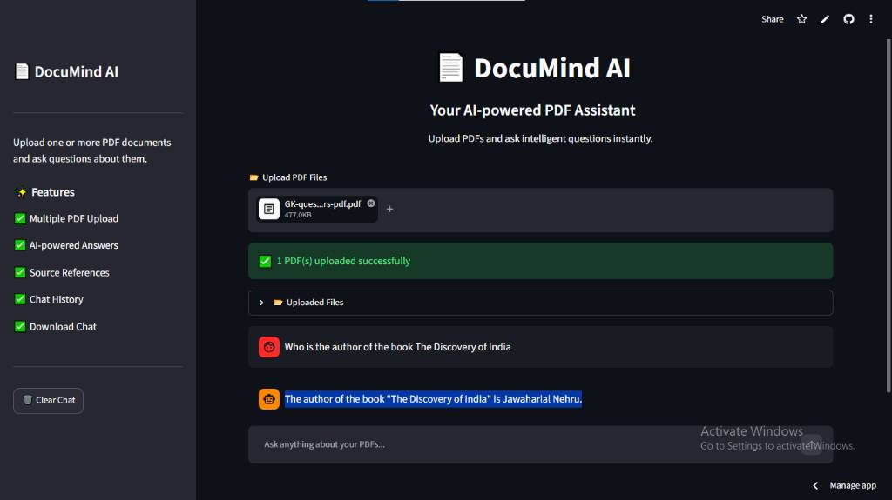
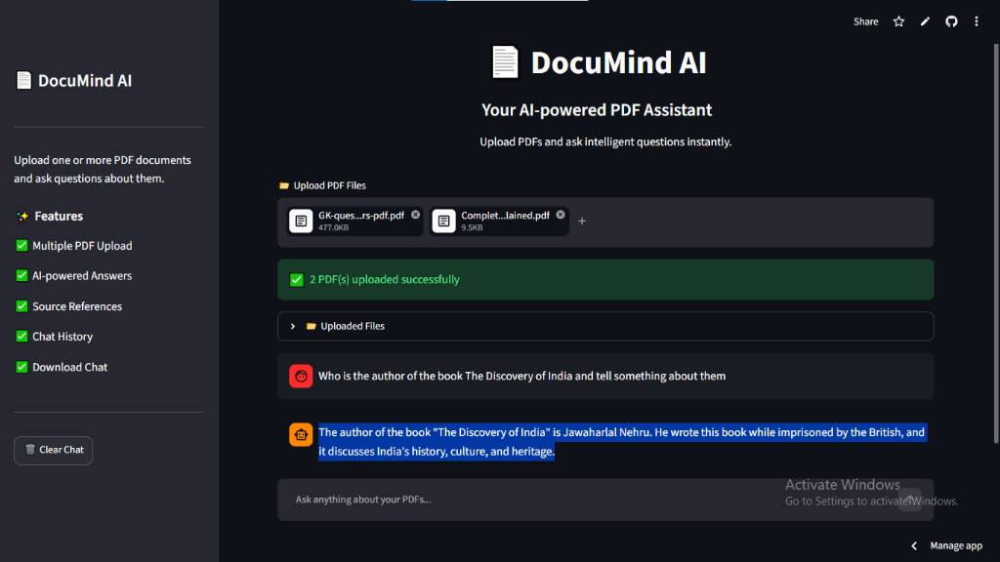
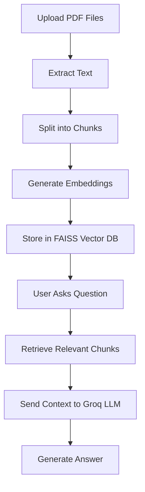

# 📄 DocuMind AI

<div align="center">


### 🚀 AI-Powered PDF Assistant using RAG, LangChain & Groq

Upload one or multiple PDFs and chat with them using advanced Retrieval-Augmented Generation (RAG).

🌐 **Live Demo:** [Click Here](https://b5jqn6wgpausaey8fuzmnx.streamlit.app/)

</div>

---

## ✨ Features

✅ Upload **Multiple PDFs**

✅ Ask questions from uploaded documents

✅ AI-generated contextual answers

✅ Source references for every answer

✅ Chat history support

✅ Download complete conversation

✅ Fast responses using **Groq LLM**

✅ Modern and responsive UI

---

## 🎥 Demo

### Dashboard


---

### Single PDF Question Answering



---

### Multi PDF Question Answering



---

## 🛠️ Tech Stack

| Technology | Usage |
|------------|-------|
| Python | Backend |
| Streamlit | Web Application |
| LangChain | RAG Pipeline |
| Groq | Large Language Model |
| FAISS | Vector Database |
| Sentence Transformers | Embeddings |
| PyMuPDF | PDF Processing |

---

## 🧠 How It Works



---

## 📂 Project Structure

```bash
DocuMind-AI/
│
├── app.py
├── rag.py
├── pdf_loader.py
├── vector_store.py
├── utils.py
├── requirements.txt
├── .env.example
├── README.md
└── images/
```

---

## ⚙️ Installation

### Clone Repository

```bash
git clone https://github.com/mayankkhadse/DocuMind-AI.git
cd DocuMind-AI
```

### Create Virtual Environment

```bash
python -m venv venv
```

Activate Virtual Environment

**Windows**

```bash
venv\Scripts\activate
```

**Mac/Linux**

```bash
source venv/bin/activate
```

---

### Install Dependencies

```bash
pip install -r requirements.txt
```

---

## 🔑 Environment Variables

Create a `.env` file:

```env
GROQ_API_KEY=your_groq_api_key
```

Get your API key from:

👉 https://console.groq.com/keys

---

## ▶️ Run Locally

```bash
streamlit run app.py
```

---

## 🌍 Deployment

This project is deployed using **Streamlit Community Cloud**.

---

## 📸 Screenshots

| Dashboard | Single PDF | Multiple PDFs |
|-----------|------------|----------------|
|  |  |  |

---

## 🚀 Live Application

Experience DocuMind AI live:

👉 **Streamlit App:** [Click Here](https://b5jqn6wgpausaey8fuzmnx.streamlit.app/)

The application is deployed on Streamlit Community Cloud and can process multiple PDFs in real time using Groq-powered Retrieval-Augmented Generation (RAG).

---

## 🔮 Future Enhancements

- Conversation memory
- Voice interaction
- OCR support for scanned PDFs
- Dark/Light mode switch
- Citation highlighting
- Export answers as PDF

---

## 🤝 Contributing

Contributions are welcome!

Feel free to fork the repository and submit pull requests.

---

## 👨‍💻 Author

### **Mayank Khadse**
B-Tech Electronics & Telecommunication Engineering
Suryodaya College of Engineering and Technology (RTMNU), Nagpur

[](https://linkedin.com/in/mayank-khadse)
[](https://github.com/mayankkhadse)

---

<div align="center">

### ⭐ If you like this project, don't forget to star the repository!

</div>
